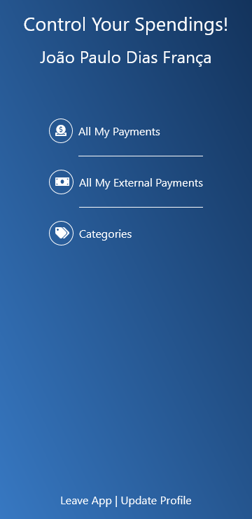

# Financial App

> Financial App is an app developed to help you control your expenses!.

On your first access you will create your account.
From there you will visit your profile and see 3 links:

- All my expenses.
  Here you can see all your categorized expenses and have a button to add new expenses.
  You can also click on the expense and go to that expense page where you can.
    - Edit this expense.
    - Delete this expenses.
    - Add a category to this expense.
    - Remove a category from this expense.
  Obs.: All newly added expenses don't have a category.

- All my external expenses.
  Here you can see all your uncategorized expenses and have a button to add new expenses.
  You can also click on the expense and go to that expense page where you can.
    - Edit this expense.
    - Delete this expenses.
    - Add a category to this expense.
    - Remove a category from this expense.
  Obs.: All newly added expenses don't have a category.

- All categories.
  Here you can see all your categories and have a button to add new categories.
  You can also click on the category and go to that category page where you can.
    - Edit this category.
    - Delete this category.
  Obs.: The icon has to be added as an URL to an image.

## Built With

- Ruby 2.7.2
- Rails 5.2.4.5
- Styled with:
  - Bootstrap 5.0
- Authentication with:
  - Devise
- Tested with:
  - Rspec
  - Capybara
  - shoulda-matchers
  - factory-bot
- Database with:
  - PostgreSQL 13

## Live Demo

[Financial App Live!](https://financial-app-jpdf00.herokuapp.com/)

## Getting Started

To get a local copy up and running follow these simple example steps.

### Prerequisites

- Ruby 2.7.2
- Rails 5.2.4.5
- Yarn
- PostgreSQL

### Setup

- Clone this repo to your local machine.
- On the terminal `cd` to the folder you cloned.

### Install

- On the terminal type `rails db:create`.
- On the terminal type `rails db:migrate`.

### Usage

- On the terminal type `rails s`
- On the browser type `localhost:3000`

### Run tests

- On the terminal `cd` to the folder you just cloned.
- On the terminal type `rspec`.

## Authors

👤 **João Paulo Dias França**

- GitHub: [@jpdf00](https://github.com/jpdf00)
- Twitter: [@jpdf00](https://twitter.com/jpdf00)
- LinkedIn: [João Paulo Dias França](https://www.linkedin.com/in/jpdf00/)

## 🤝 Contributing

Contributions, issues, and feature requests are welcome!

Feel free to check the [issues page](https://github.com/jpdf00/financial-app/issues).

## Show your support

Give a ⭐️ if you like this project!

## Acknowledgments

- Design idea by [Gregoire Vella on Behance](https://www.behance.net/gallery/19759151/Snapscan-iOs-design-and-branding?tracking_source=)

## 📝 License

This project is [MIT](./LICENSE) licensed.
